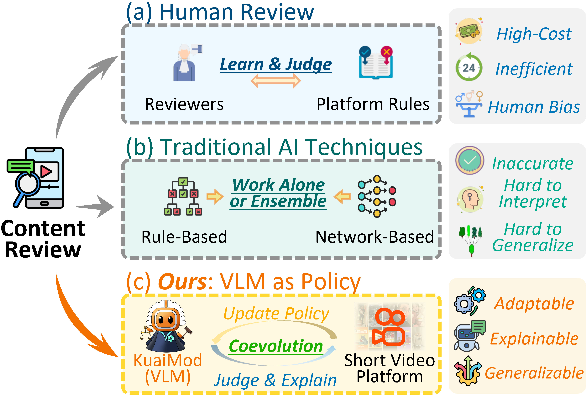
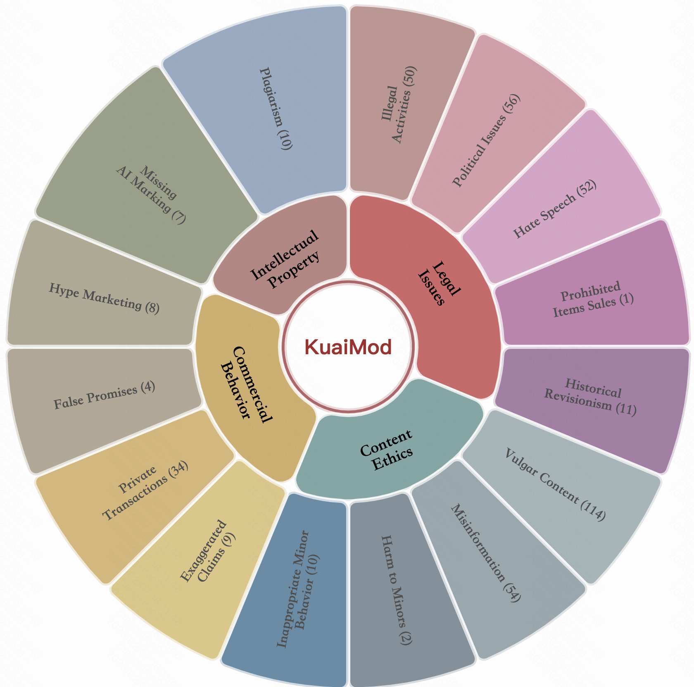
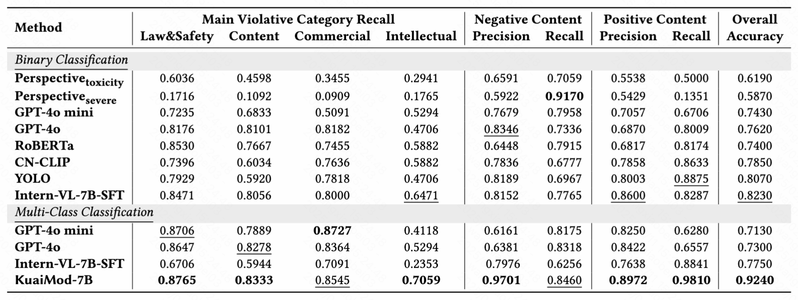
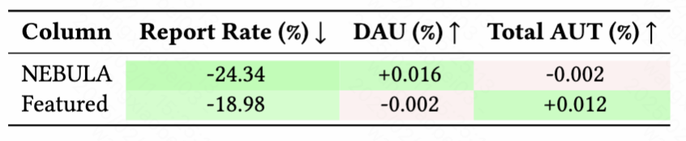

# VLM as Policy: Common-Law Content Moderation Framework for Short Video Platform

<!--  
 
 
  
 
 
 

 -->

      
  Logo of <b>KuaiMod</b>. 
   

##  Introduction of Kuaimod

      
  A visualization about three moderation paradigms: Manual, traditional AI-assisted and our <b>KuaiMod</b> paradigm. 
   

Code for the Paper "[VLM as Policy: Common-Law Content Moderation Framework for Short Video Platform]()".

For more details, please refer to the project page with dataset exploration and visualization tools: [https://kuaimod.github.io/](https://kuaimod.github.io/).

[[Webpage](https://kuaimod.github.io/)] [[Visualization](https://kuaimod.github.io/visualization.html)] [[Github]](https://github.com/KuaiMod/KuaiMod.github.io)

## Data Visualization

🎰 You can explore the dataset in an interactive way [here](https://kuaimod.github.io/visualization.html).

;<iframe src="https://kuaimod.github.io/visualization.html" width="100%" height="800px"></iframe>

;<iframe src="https://kuaimod.github.io/rolling.html" width="100%" height="500px"></iframe>

      
  Distribution for the examples. 
   

##  Implementation details of Kuaimod

       
   "Offline adaptation stage of KuaiMod: We post-train the YuanQi-7B with state-transition format data. After SFT and DPO training, KuaiMod is transformed into a video moderator to provide online services. ".

<!-- 

Click to expand/collapse the visualization page screenshot.

 -->

      
   "Online deployment stage of KuaiMod: The initially trained KuaiMod model is deployed into Kuaimod as a moderation agent. KuaiMod interacts with the online environment and iteratively refines its policy with user feedback in the RL manner.".

##  Performance

### Offline Experiments

      
   "Performance of Various Moderation Methods on the KuaiMod Benchmark. We categorize the moderation methods into <b>Binary Classification</b> and <b>Multi-class Classification</b>. The binary classification only determines whether a video is violative or not, while the multi-class classification requires the model to directly classify the video into its respective category. Optimal and sub-optimal performance is denoted in bold and underlined fonts, respectively.".

### Online Experiments

      
   "KuaiMod's online A/B test results for comprehensive ecosystem governance on Kuaishou NEBULA and Featured.".

