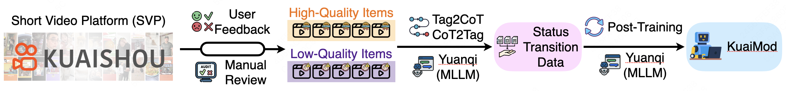

# VLM as Policy: Common-Law Content Moderation Framework for Short Video Platform

 
 
 
  
 
 
 

      
  Tentative logo for <b>KuaiMod</b>. 
   "KuaiMod".

Code for the Paper "[VLM as Policy: Common-Law Content Moderation Framework for Short Video Platform]()".

For more details, please refer to the project page with dataset exploration and visualization tools: [https://kuaimod.github.io/](https://kuaimod.github.io/).

[[Webpage](https://kuaimod.github.io/)] [[Visualization](https://kuaimod.github.io/visualization.html)] [[Github]](https://github.com/KuaiMod/KuaiMod.github.io)

<iframe src="https://kuaimod.github.io/visualization.html" width="100%" height="800px"></iframe>

### Data Visualization

🎰 You can explore the dataset in an interactive way [here](https://kuaimod.github.io/visualization.html).

      
  Distribution for the examples. 
   

<!-- 

Click to expand/collapse the visualization page screenshot.

 -->

